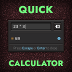

# Quick Calculator

A pop-up calculator for Factorio. Do quick math without leaving the game.

## Usage

Open/close the calculator with:

- Hotkey: `Ctrl + Alt + C`
- Console command: `/qcalc`

Type an expression in the input field; the result updates as you type. Press `Enter` or `Escape` to close.

## Supported syntax

| Category | Operators / names |
|----------|-------------------|
| Arithmetic | `+` `-` `*` `/` |
| Modulo | `%` |
| Exponent | `^` or `**` |
| Factorial | `!` (single) |
| Unary signs | `-x`, `+x` |
| Grouping | `( )` |
| Functions | `sqrt` `abs` `exp` `ln` `log` `sin` `cos` `tan` `asin` `acos` `atan` `floor` `ceil` |
| Constants | `pi` `e` |

> Trigonometric functions use radians.

## License

[MIT](LICENSE)
